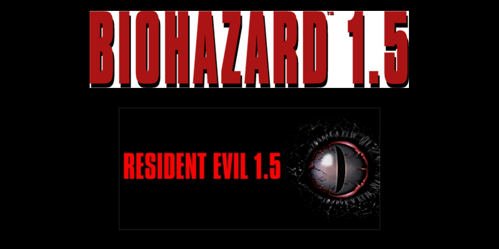
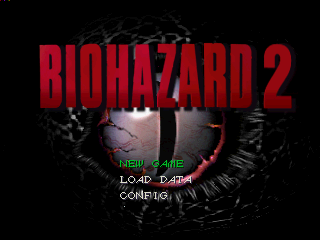
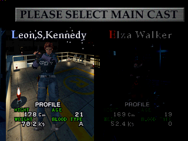
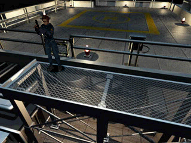
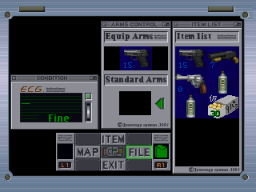
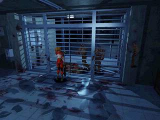
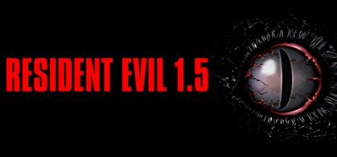

<h1 align="center">RE15pc</h1>

<p align="center">
  
</p>

<p align="center">
  <b>A native Windows x64 preservation port of the Biohazard&nbsp;2 November&nbsp;6,&nbsp;1996 prototype — Resident&nbsp;Evil&nbsp;1.5 — built by statically recompiling the disc's MIPS executable and its seven overlays.</b>
</p>

<p align="center">
  <a href="#quick-start">Quick start</a> ·
  <a href="#build-the-executable">Build the exe</a> ·
  <a href="#product-tour">Screens</a> ·
  <a href="#what-works-today">Status</a> ·
  <a href="#controllers">Controllers</a> ·
  <a href="#verification">Verification</a> ·
  <a href="docs/phases.md">Phases</a> ·
  <a href="CONTRIBUTING.md">Contributing</a>
</p>

<p align="center">
  
  
  <a href="LICENSE"></a>
  <a href="docs/phases.md"></a>
  
  <a href="CONTRIBUTING.md"></a>
  <a href="https://github.com/BlackLabelHQ/RecompOne"></a>
</p>

<p align="center">
  
</p>

> [!IMPORTANT]
> **You must supply your own disc.** This repository carries no Capcom code, audio or disc image, and none of the recompiled output derived from the disc is distributed here. The disc is identified by hash in `disc-manifest.json`; it is not included and never will be. The only game-derived imagery committed here is the small set of screenshots in this README, listed by name in [NOTICE](NOTICE). This is an unofficial, non-commercial preservation project, not affiliated with or endorsed by Capcom.

---

## What this is

*Resident Evil 1.5* is the version of Resident Evil 2 that Capcom scrapped in early 1997, mid-development. The November 6, 1996 build survives as a disc image, and for decades the only way to see it was to emulate it.

**RE15pc runs it natively.** The disc's MIPS executable and its seven overlays are statically recompiled to C# by [RecompOne](https://github.com/BlackLabelHQ/RecompOne), and a Windows host boots the result on the real GPU. No emulator, no BIOS, no interpreter — the guest code becomes native code that a .NET runtime executes directly.

The project is built around one rule: **fix what the port breaks, and invent nothing.** Where the prototype itself is incomplete — and as an unfinished build, it often is — that incompleteness is preserved rather than papered over. Every status claim below traces to a recorded run with `run.json`, `verdict.txt` and an exit code; the tools that produce them are in `tools/`, and you can re-run all of them.

| | |
|---|---|
| **Disc** | Biohazard 2, November 6, 1996 prototype (Resident Evil 1.5) |
| **Recompiler** | RecompOne, pinned at `d81dec8c9622fdcd0865d73588a3baa8d3c3a605` |
| **Recompiled output** | ~98 MB of C# across 5150 generated functions and 7 overlays |
| **Target** | Windows x64, strict preservation. Deterministic rebuilds across 10 generated files. |
| **Disc coverage** | 334-file ledger: 40 partially observed, 294 unverified |

---

## Product tour

Every frame below is a real 320×240 framebuffer readback written by this port's own diagnostics while running the actual disc — not a mock-up, and not a screenshot of an emulator. Each one comes from a run whose recorded verdict is `PASS`.

<table>
<tr>
<td width="50%" valign="top">
<br/>
<sub><b>Boot to title</b> — the November 6, 1996 build reaches its own title menu from a cold start, artwork and all. 320×240, frame 1650.</sub>
</td>
<td width="50%" valign="top">
<br/>
<sub><b>Character select</b> — <code>PLEASE SELECT MAIN CAST</code>, with both scenarios: Leon S. Kennedy and <b>Elza Walker</b>, the protagonist who never shipped. 320×240, frame 1200.</sub>
</td>
</tr>
<tr>
<td width="50%" valign="top">
<br/>
<sub><b>The first playable room</b> — Leon on the rooftop. Rendered background, working collision against the railing, and a deliberate exit through the door into room 116. 320×240, frame 2700.</sub>
</td>
<td width="50%" valign="top">
<br/>
<sub><b>Inventory</b> — <code>ARMS CONTROL</code> and <code>ITEM LIST</code>, opened and closed with state preserved, item selection working, and a weapon-equipment change verified. 320×240, frame 2500.</sub>
</td>
</tr>
<tr>
<td width="50%" valign="top">
<br/>
<sub><b>Actors and damage</b> — Elza facing two original actors through a barred shutter. A separate 4000-frame gate verifies within-run damage and their persistent removal, distinguishing health resets from respawns. 320×240, frame 4000.</sub>
</td>
<td width="50%" valign="top">

<p align="center"></p>

<sub><b>Key art</b> — the project's identity art, also composed into the social card above with <code>tools/New-SocialPreview.ps1</code>.</sub>
</td>
</tr>
</table>

---

## What works today

Honest status, split by what has actually been demonstrated under a recorded gate versus what has not.

### Verified

| Area | Evidence |
|---|---|
| **Cold boot to title** | 180-frame native gate, PASS, exact frame counts, both positive cases byte-identical |
| **Both player entries** | Leon's first-room gate (room 117 → 116) and Elza's entry to `ROOM1031.RDT` both pass |
| **Movement and collision** | Turning, world movement, railing collision with sliding, and one deliberate door transition — paired against an idle control run |
| **Rendering** | Rooftop and room backgrounds render; the earlier missing-background defect traced to synchronous GPU readback and repaired |
| **Inventory** | Open/close with state preserved, item selection, a weapon-equipment change, pistol reload and the ammunition menu |
| **Combat** | An aimed two-shot firing gate passes on ammunition and control; a 4000-frame gate verifies damage and persistent actor removal |
| **Audio** | Non-zero queued PCM inspected passively — the mixer is never advanced to manufacture a sample |
| **Overlays** | All 49 ordered overlay replacements exercised |
| **Determinism** | Recompilation reproduces 10 generated files byte-for-byte |
| **Controllers** | Xbox pads enumerated through the XInput backend; button and axis polling verified — see [Controllers](#controllers) |

### Not yet verified

| Area | Status |
|---|---|
| Full room and scenario coverage | Open — 294 of 334 disc files remain unverified |
| Remaining interactions and enemy behaviour | Open — one encounter and two actors are covered, not the game |
| Save / load persistence | Open |
| Full native-input certification | Open — known synthetic arrow-event gaps fail acceptance rather than being swallowed |
| Stability gate | Open — representative 30-minute sessions not yet run |

The phase table in [`docs/phases.md`](docs/phases.md) is the authoritative version of this; **phase 2 of 5 has passed locally**, and gold is not close. Synthetic dispatch success, nonzero audio, pixel counts and a clean smoke run deliberately do **not** count as playability here.

---

## Requirements

| | |
|---|---|
| OS | Windows x64 |
| To **run** a published build | Nothing else — the runtime is bundled |
| To **build** from source | Git, PowerShell 7, .NET SDK 10 |
| Your own disc | `Bio2Nov96.bin` (124.3 MB) with `Bio2Nov96.cue` beside it |

> [!NOTE]
> GitHub Actions is currently blocked from starting by account billing limits, so a local pass is not a remote check pass. This is stated rather than hidden because the commit-convention workflow is real enforcement, and it is not running.

---

## Quick start

```powershell
# 1. Restore the toolchain: commit hook, pinned RecompOne clone, tracked patches, build
pwsh -File bootstrap.ps1

# 2. Recompile the disc into C# (writes generated/, ~98 MB).
#    The config carries the cue path and the output directory internally.
dotnet run --project RecompOne/RecompOne.Recompiler -- port/config/bio2nov96.json

# 3. Play
dotnet run --project port/RE15pc -c Release -- --cue .\Bio2Nov96.cue
```

`bootstrap.ps1` pins RecompOne at `d81dec8c…` and applies the 12 tracked patches in `patches/`. It is idempotent.

> [!WARNING]
> Do **not** regenerate the curated function maps with `--autoconfigure`. That discards recovered computed-jump targets and silently breaks overlay dispatch.

---

## Build the executable

To produce a `RE15pc.exe` you can double-click on a machine with no .NET installed:

```powershell
pwsh -File tools/Publish-Exe.ps1
```

This writes a self-contained Windows x64 build to `dist/`, carrying the runtime, the RecompOne runtime, the compiled guest and every native dependency. It also copies your disc, cue sheet, `settings.json` and `interface.ini` in, so `dist/` is directly runnable, and it verifies afterwards that the icon resource landed and that `cimgui.dll`, `glfw3.dll`, `SDL2.dll` and `soft_oal.dll` are actually present.

### Why a folder and not one file

`-SingleFile` exists but is **not** the default, because two dependencies of this host fail under single-file packing — and they fail at runtime, not at build time:

- **ImGui.NET** locates `cimgui.dll` through `Assembly.Location`, which is empty for an assembly inside a single-file bundle. The host then calls into an unloaded native library and dies with `0xC0000005`. It surfaces late — in `HostWindow.OnClosing` → `ConfigManager.SaveView` → `igSaveIniSettingsToMemory` — so **the game runs and the process only crashes on the way out.** A single-file build looks healthy right up until it corrupts its own exit.
- **MonoMod.RuntimeDetour**, which RecompOne uses for mod hooks, documents single-file as unsupported, and the SDK emits an explicit warning saying so.

Both were reproduced against SDL 2.30.8 / net10.0: `PublishSingleFile=true` aborts with `0xC0000005`; `PublishSingleFile=false` completes and passes the 180-frame gate. Trimming stays off for the same class of reason — the guest is reached through dispatch tables, so a trimmer would delete code that looks unreferenced and break dispatch at runtime.

---

## Controllers

**Xbox controllers work through SDL's XInput backend**, and that is a choice the host makes explicitly rather than something it gets by accident.

`InputManager.Initialize` sets `SDL_JOYSTICK_RAWINPUT=0` before initialising SDL's game-controller subsystem. That disables SDL's RawInput backend, which is what pushes XInput-capable pads onto the **XInput driver** instead. The effect is directly observable in the device path SDL reports:

| `SDL_JOYSTICK_RAWINPUT` | Device path SDL reports | Driver that took the pad |
|---|---|---|
| `0` — what the runtime sets | `XInput#0` | **XInput** |
| `1` — SDL's default | `\\?\HID#VID_045E&PID_028E&IG_00#…` | RawInput / HID |

Verify it on your own machine, with your own pad:

```powershell
pwsh -File tools/Test-GamepadBackend.ps1 -VirtualPad
```

The tool answers three separate questions instead of asserting one: it scans the bundled `SDL2.dll` for the XInput backend markers (`SDL_XINPUT_ENABLED` and the built-in `xinput,*,a:b0,…` mapping, both present in SDL 2.30.8), reproduces the runtime's exact hint and init sequence and reports which driver won, and exercises button-plus-axis polling. The polling check attaches an SDL **virtual** controller, so it proves the data path with nothing plugged in — and it is ordered before any physical pad is touched, because polling a real pad first stops a subsequently attached virtual one from reporting state at all (reproduced directly; an SDL virtual-device quirk, not a port defect).

Bluetooth and non-XInput pads fall back to SDL's HIDAPI backend, which is also compiled in. Two pads are supported, in digital or analog mode, with per-device binding selection and rumble.

---

## Verification

Nothing here is asserted without a command that can fail.

```powershell
# Focused checks, then the native acceptance harness with its negative controls
dotnet build tests/RE15pc.Checks/RE15pc.Checks.csproj -c Release
pwsh -File tools/Test-Acceptance.ps1

# Gameplay gates
pwsh -File tools/Test-FirstRoom.ps1        # Leon: room 117 -> 116
pwsh -File tools/Test-ElzaEntry.ps1        # Elza: entry to ROOM1031.RDT
pwsh -File tools/Test-WeaponFire.ps1
pwsh -File tools/Test-EnemyDamage.ps1
pwsh -File tools/Test-InventoryMenu.ps1
pwsh -File tools/Test-InventoryEquip.ps1

# Integrity
pwsh -File tools/Test-RecompileDeterminism.ps1   # 10 files, byte-identical
pwsh -File tools/New-DiscManifest.ps1 -Check     # your disc matches the manifest
pwsh -File tools/Test-ContentInventory.ps1

# Controllers
pwsh -File tools/Test-GamepadBackend.ps1 -VirtualPad
```

The acceptance harness deliberately runs **negative controls** alongside the positive ones — a silent-audio case, a timeout case and a refused non-empty output directory — and fails if any of them passes. A suite that can only agree with itself proves nothing.

For a scripted investigation run:

```powershell
dotnet run --project port/RE15pc -c Release --no-build -- --frames 2100 --timeout 120 --input "90:start,240:cross,300:cross,600:up:600,1250:cross,1800:up:240" --trace-input --verify-audio
```

`frame:buttons:duration` holds buttons for that many frames; an omitted duration means 12, and `none` releases them. Bounded runs write to a unique directory under `out/runs`, copy your settings and memory cards in to protect player state, and record `run.json`, `verdict.txt` and a process exit code.

> [!NOTE]
> A **bounded** run (`--frames` or `--smoke`) refuses to start outside a repository checkout, because acceptance evidence has to name its revision and configuration. An interactive launch has no such duty and proceeds, recording `unknown` provenance instead. This is why the published exe plays when double-clicked but declines a gate run from the wrong directory — with an explanation rather than a stack trace.

---

## Repository layout

```
port/RE15pc/          the host: options, disc identity, overlay policy, diagnostics
port/config/          recompiler configuration and the curated function maps
patches/              12 tracked diffs against the pinned RecompOne commit
tools/                gates, generators and diagnostics (all PowerShell)
tests/RE15pc.Checks/  the 166 focused checks
docs/                 acceptance evidence, phase gates, per-subsystem findings
assets/               wordmark, key art, app icon, social card
docs/screenshots/     the framebuffer captures shown above
bootstrap.ps1         restores the pinned toolchain, idempotently
generated/            recompiled C# — built locally from your disc, never committed
dist/                 published build — never committed
```

---

## Repository rules

All commits follow [Conventional Commits v1.0.0](https://www.conventionalcommits.org/en/v1.0.0/), enforced by a tracked `commit-msg` hook and by the workflow in [CONTRIBUTING.md](CONTRIBUTING.md).

**Never commit the disc, `generated/`, `out/`, `dist/`, saves, or the separate `RecompOne/` clone.** Recompiled code and game-derived binaries are produced on your machine from your own disc; `dist/` in particular is a ~154 MB folder with a transcription of the disc's executable compiled into it (plus your own disc image, if it copies one in). Runtime and recompiler changes are delivered as patches against the pinned upstream, never as edits to generated game code.

---

## Further reading

| Document | Contents |
|---|---|
| [`docs/acceptance.md`](docs/acceptance.md) | What the acceptance harness proves, and the limits of that proof |
| [`docs/phases.md`](docs/phases.md) | The five phase gates and where the project actually stands |
| [`docs/first-room.md`](docs/first-room.md) | Leon's first-room gate, in detail |
| [`docs/weapon-fire.md`](docs/weapon-fire.md) | The firing and damage gates |
| [`docs/content-coverage.md`](docs/content-coverage.md) | The 334-file disc ledger and its 294 unverified entries |
| [`docs/model-inventory.md`](docs/model-inventory.md) | 102 model blocks across all 54 EMS/PLD/PLW files |
| [`docs/background-readback.md`](docs/background-readback.md) | The synchronous GPU readback defect and its repair |
| [`docs/keyboard-input.md`](docs/keyboard-input.md) | Native input evidence and its known gaps |
| [`docs/compatibility.md`](docs/compatibility.md) | Disc identity, upstream pin, and what "complete" means for an unfinished build |
| [`docs/boot-status.md`](docs/boot-status.md) | Historical investigation log — earlier interpretations are not current claims |

---

## Licence

This repository's own contents — scripts, configuration, documentation and the image assets under `assets/` and `docs/screenshots/` — are MIT licensed; see [LICENSE](LICENSE) and [NOTICE](NOTICE). RecompOne is MIT licensed, © flaffy, and is fetched at a pinned commit rather than vendored. No licence is asserted over anything derived from the disc.

No Capcom game code, art, audio, disc image or Sony BIOS is redistributed. *Resident Evil*, *Biohazard* and related names and characters are trademarks of Capcom Co., Ltd.

<p align="center"><sub>An unofficial, non-commercial preservation and research effort.<br/>Built because the build exists, and someone should be able to play it.</sub></p>
